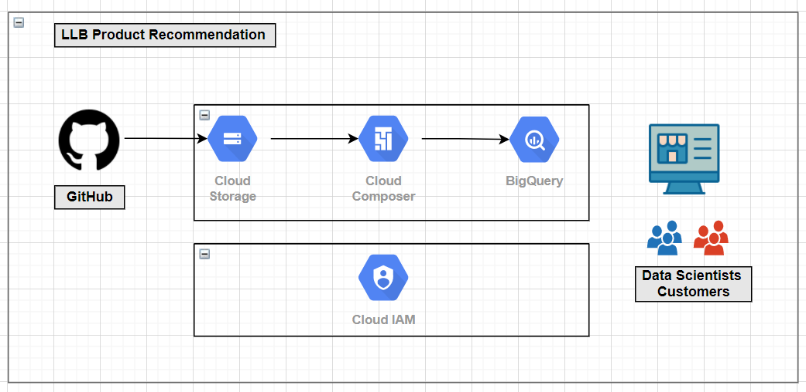
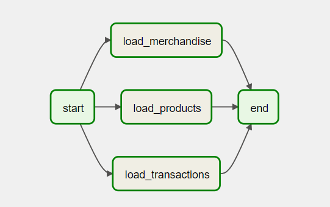
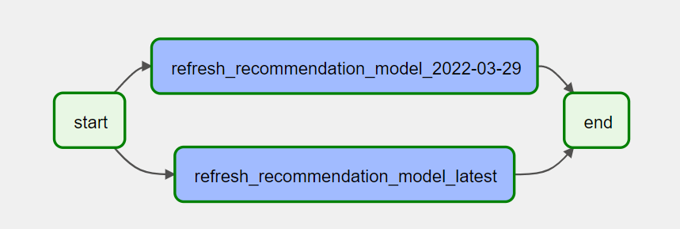
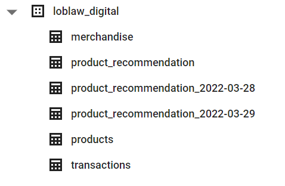

# LLD

LLD Data Engineering Take home challenge 

Author: Pramod Nagare

Contact: pramodngare1993@gmail.com

## Architecture:

## Data Exploration:

1. Products:
    
    This dataset contains information about different products we have on our e-commerce platform

    Schema:
        
        product_id: String
        merchendise_id: String
        product_name: String

2. Merchandise:
    
    This dataset contains information about product merchandise

    Schema:
        
        code: String
        name: String

3. Transactions:
    
    This dataset contains all the transations from different customers

    Schema:

        customer: int
        date: date
        itemList: [
            item: String
            price: float
            quantity: float
        ]
        store: String

## Pipelines:

1. Refresh product specific tables
    
    Given that we have products, merchandise and transaction data, consider we need to create a pipeline that runs on regular schedule (here daily @ 9:00 AM)

    #### DAG: loblaw_digital_load_data_dag

    

2. Update Recommendation Model

    Once we have significant updates to product and transactions specific data we can refresh Product recommendation model on ad-hoc basis

    #### DAG: product_recommendation_dag
    
    

### Setup:

1. Create a GCP project
2. Create a GCS bucket
3. Upload the data files to created bucket
4. Create Big Query Dataset
5. Create Cloud Composer Instance
6. Update the DAGs to composer dag storage bucket
7. Update airflow Variables for respective pipelines

#### Variable: loblaw_load_var

    {
        "BQ_CONN_ID": "",
        "BQ_PROJECT_ID": "sonorous-wharf-343523",
        "BQ_DATASET": "loblaw_digital",
        "BUCKET": "loblaw_digital",
        "BQ_TABLE_LIST": [
            {
                "table_name": "products",
                "file_path": ["products.csv"],
                "source_format": "CSV",
                "field_delimiter": ",",
                "skip_leading_rows": 1,
                "schema_fields": [{
                        "description": "product_id",
                        "name": "product_id",
                        "type": "STRING",
                        "mode": "NULLABLE"
                        },
                        {
                        "description": "merchendise_id",
                        "name": "merchendise_id",
                        "type": "STRING",
                        "mode": "NULLABLE"
                        },
                        {
                        "description": "Name of the product",
                        "name": "product_name",
                        "type": "STRING",
                        "mode": "NULLABLE"
                        }],
                "autodetect": "false"
            },

            {
                "table_name": "merchandise",
                "file_path": ["mch_categories.tsv"],
                "source_format": "CSV",
                "field_delimiter": "\\t",
                "skip_leading_rows": 1,
                "schema_fields": [{
                        "description": "Merchandise Code",
                        "name": "code",
                        "type": "STRING",
                        "mode": "NULLABLE"
                        },
                        {
                        "description": "Merchendise Name",
                        "name": "name",
                        "type": "STRING",
                        "mode": "NULLABLE"
                        }],
                "autodetect": "false"
            },

            {
                "table_name": "transactions",
                "file_path": ["transactions.txt"],
                "source_format": "NEWLINE_DELIMITED_JSON",
                "skip_leading_rows": 0,
                "autodetect": "true"
            }
        ],
        "internal_email": "pramodnagare1993@gmail.com",
        "product_recommnedation_tablename": "product_recommendation"
    }

#### Variable: loblaw_product_recomm_var

    {
        "BQ_CONN_ID": "",
        "BQ_PROJECT_ID": "sonorous-wharf-343523",
        "BQ_DATASET": "loblaw_digital",
        "BUCKET": "loblaw_digital",
        "BQ_TARGET_TABLE": "product_recommendation",
        "internal_email": "pramodnagare1993@gmail.com"
    }

Variable: loblaw_product_recomm_sql

    WITH A AS (SELECT P.product_name, P.product_id AS `base_item`, T.item AS `copurchased_item` 
    FROM `sonorous-wharf-343523.loblaw_digital.transactions`, UNNEST(itemList) AS T, UNNEST(itemList) AS I
    JOIN `sonorous-wharf-343523.loblaw_digital.products` AS P 
    ON I.item = P.product_id
    WHERE T.item != P.product_id AND T.item NOT IN ('20189092_EA', '20668578_EA')),

    B AS (
    SELECT 	A.product_name, A.base_item, A.copurchased_item, SUM(1) AS `copurchased_frequency`
    FROM A 
    GROUP BY product_name, base_item, copurchased_item),

    C AS (
    SELECT product_name, base_item, copurchased_item, copurchased_frequency,
    ROW_NUMBER() OVER (PARTITION BY base_item ORDER BY copurchased_frequency DESC) AS top_transactions
    FROM B )

    SELECT C.product_name, base_item, P.product_name AS `recommended_product`, copurchased_item AS `recommended_product_id`, copurchased_frequency, top_transactions FROM C
    JOIN `sonorous-wharf-343523.loblaw_digital.products` AS P
    ON C.copurchased_item = P.product_id
    WHERE top_transactions <= 5
    ORDER BY base_item, top_transactions

### Solution:

1. Create a function to recommend top 5 product for given product id using co-purchsed frequency:

SQL as function: 

    SELECT * 
    FROM `loblaw_digital.product_recommendation` 
    WHERE base_item = <product_id>

2. Product Recommendation for specific product id:
    
        {
            "name": "Pramod Nagare",
            "email": "pramodnagare1993@gmail.com",
            "20592676_EA": [
                    {"product_id": "20379763_EA", "product_name": "Celebration Cupcakes, White"}, 
                    {"product_id": "20175355001_KG", "product_name": "Bananas, Bunch"},
                    {"product_id": "20812144001_EA", "product_name": "Grade A White Eggs, Large"},
                    {"product_id": "20070132001_EA", "product_name": "English Cucumbers"},
                    {"product_id": "20049778001_EA", "product_name": "Strawberries"}
                ],
            "20801754003_C15": [
                {"product_id": "20175355001_KG", "product_name": "Bananas, Bunch"}, 
                {"product_id": "20801754001_C15", "product_name": "Pepsi"},
                {"product_id": "20962518_EA", "product_name": "Milk, 2%"},
                {"product_id": "20812144001_EA", "product_name": "Grade A White Eggs, Large"},
                {"product_id": "20070132001_EA", "product_name": "English Cucumbers"}
                ]
        }

3. How would you deploy and serve the model:

    As we have 2 different pipelines, <i> loblaw_digital_load_data_dag </i> and <i> product_recommendation_dag </i>; we can schedule as per the business requirement which will refresh the product specific tables recommendation model based on new data.

    The query/model (table product_recommendation) we will refer to get recommended products will be up-to-date with latest transactions taken into consideration and also we are maintaining different versions for models (table product_recommendation_<YYYY-MM-DD>)

    